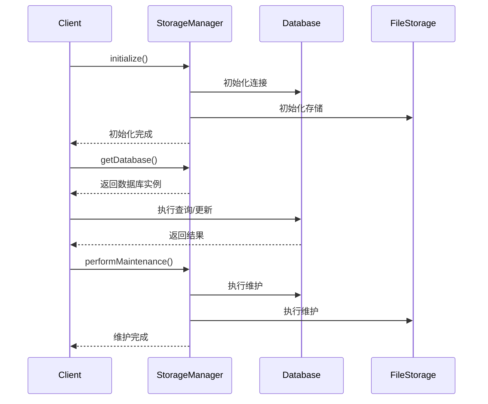

# Storage 模块

该模块提供了统一的存储管理系统，整合了数据库存储和文件存储功能，并包含配置管理、监控和维护等辅助功能。

## 核心架构

### 主要组件
1. **IStorageManager** - 存储管理主接口
2. **IDatabase** - 数据库存储接口
3. **IFileStorage** - 文件存储接口
4. **IStorageConfig** - 存储配置接口
5. **IStorageMonitor** - 存储监控接口
6. **IStorageRecovery** - 存储恢复接口

### 数据流
1. 存储初始化 → 2. 请求处理 → 3. 数据存储/检索 → 4. 状态监控 → 5. 定期维护

## 核心接口

### IStorageManager
```kotlin
interface IStorageManager {
    // 初始化存储系统
    suspend fun initialize()
    
    // 关闭存储系统
    suspend fun shutdown()
    
    // 获取数据库实例
    fun getDatabase(): IDatabase
    
    // 获取文件存储实例
    fun getFileStorage(): IFileStorage
    
    // 执行存储维护
    suspend fun performMaintenance()
    
    // 获取存储状态
    fun getStorageStatus(): StorageStatus
    
    // 观察存储事件
    fun observeStorageEvents(): Flow<StorageEvent>
}
```

## 存储状态

### StorageStatus
```kotlin
data class StorageStatus(
    val databaseStatus: DatabaseStatus,    // 数据库状态
    val fileSystemStatus: FileSystemStatus, // 文件系统状态
    val totalStorageUsage: StorageUsage,   // 总存储使用情况
    val lastMaintenance: Instant           // 最后维护时间
)
```

### DatabaseStatus
```kotlin
data class DatabaseStatus(
    val isConnected: Boolean,  // 连接状态
    val version: Int,          // 版本
    val tableCount: Int,       // 表数量
    val totalRecords: Long,    // 总记录数
    val storageUsage: StorageUsage, // 存储使用
    val performance: PerformanceMetrics // 性能指标
)
```

## 配置管理

### IStorageConfig
```kotlin
interface IStorageConfig {
    // 获取数据库配置
    fun getDatabaseConfig(): DatabaseConfig
    
    // 获取文件系统配置
    fun getFileSystemConfig(): FileSystemConfig
    
    // 获取维护配置
    fun getMaintenanceConfig(): MaintenanceConfig
}
```

### DatabaseConfig
```kotlin
data class DatabaseConfig(
    val connectionString: String, // 连接字符串
    val maxConnections: Int,      // 最大连接数
    val timeout: Long,            // 超时时间
    val retryPolicy: RetryPolicy  // 重试策略
)
```

## 监控系统

### IStorageMonitor
```kotlin
interface IStorageMonitor {
    // 开始监控
    fun startMonitoring()
    
    // 停止监控
    fun stopMonitoring()
    
    // 获取监控指标
    fun getMetrics(): StorageMetrics
    
    // 观察性能指标
    fun observePerformance(): Flow<PerformanceMetrics>
}
```

## 恢复系统

### IStorageRecovery
```kotlin
interface IStorageRecovery {
    // 检查存储完整性
    suspend fun checkIntegrity(): IntegrityResult
    
    // 执行恢复操作
    suspend fun performRecovery(strategy: RecoveryStrategy)
    
    // 验证恢复结果
    suspend fun validateRecovery(): ValidationResult
}
```

## 使用示例

### 基本存储操作
```kotlin
val storageManager: IStorageManager = // 获取存储管理器

// 初始化存储
storageManager.initialize()

// 获取数据库实例
val database = storageManager.getDatabase()

// 获取文件存储实例
val fileStorage = storageManager.getFileStorage()

// 获取存储状态
val status = storageManager.getStorageStatus()
println("数据库状态: ${status.databaseStatus.isConnected}")

// 观察存储事件
storageManager.observeStorageEvents().collect { event ->
    when (event) {
        is StorageEvent.DatabaseEvent -> println("数据库事件: ${event.type}")
        is StorageEvent.FileSystemEvent -> println("文件系统事件: ${event.type}")
        is StorageEvent.ErrorEvent -> println("错误事件: ${event.error}")
    }
}
```

### 存储管理器实现类使用
```kotlin
// 创建存储管理器实例
val context: Context = // Android上下文
val storageManager = StorageManager(context)

// 初始化存储系统
lifecycleScope.launch {
    try {
        storageManager.initialize()
        println("存储系统初始化成功")
    } catch (e: Exception) {
        println("存储系统初始化失败: ${e.message}")
    }
}

// 获取存储状态
val status = storageManager.getStorageStatus()
println("数据库连接状态: ${status.databaseStatus.isConnected}")
println("数据库版本: ${status.databaseStatus.version}")
println("文件系统状态: ${status.fileSystemStatus.isAvailable}")
println("总存储使用: ${status.totalStorageUsage.usedBytes}/${status.totalStorageUsage.totalBytes}")

// 执行存储维护
lifecycleScope.launch {
    try {
        storageManager.performMaintenance()
        println("存储维护完成")
    } catch (e: Exception) {
        println("存储维护失败: ${e.message}")
    }
}
```

### 数据库实现类使用

#### Room数据库实现
```kotlin
// 创建Room数据库实现
val context: Context = // Android上下文
val database = RoomDatabaseImpl(context)

// 初始化数据库
lifecycleScope.launch {
    try {
        database.initialize()
        println("数据库初始化成功")
    } catch (e: Exception) {
        println("数据库初始化失败: ${e.message}")
    }
}

// 获取传感器数据存储
val sensorStorage = database.getSensorStorage()

// 获取聊天消息存储
val chatStorage = database.getChatStorage()

// 清理数据库
lifecycleScope.launch {
    try {
        database.cleanup()
        println("数据库清理成功")
    } catch (e: Exception) {
        println("数据库清理失败: ${e.message}")
    }
}
```

#### 传感器数据存储使用
```kotlin
// 获取传感器数据存储
val sensorStorage = database.getSensorStorage() // ISensorStorage实现

// 保存传感器数据
val sensorData = SensorData(
    id = UUID.randomUUID().toString(),
    sensorType = "ACCELEROMETER",
    timestamp = Instant.now(),
    values = floatArrayOf(0.1f, 9.8f, 0.3f),
    accuracy = 3
)

lifecycleScope.launch {
    try {
        sensorStorage.saveSensorData(sensorData)
        println("传感器数据保存成功")
    } catch (e: Exception) {
        println("传感器数据保存失败: ${e.message}")
    }
}

// 批量保存传感器数据
val sensorDataList = listOf(
    SensorData(/* ... */),
    SensorData(/* ... */)
)

lifecycleScope.launch {
    try {
        sensorStorage.saveSensorDataBatch(sensorDataList)
        println("批量传感器数据保存成功")
    } catch (e: Exception) {
        println("批量传感器数据保存失败: ${e.message}")
    }
}

// 查询传感器数据
val query = SensorDataQuery(
    timeRange = Instant.now().minusSeconds(3600) .. Instant.now(),
    sensorTypes = setOf("ACCELEROMETER", "GYROSCOPE"),
    limit = 100
)

// 收集查询结果流
lifecycleScope.launch {
    sensorStorage.querySensorData(query).collect { dataList ->
        println("查询到 ${dataList.size} 条传感器数据")
        dataList.forEach { data ->
            println("传感器类型: ${data.sensorType}, 时间: ${data.timestamp}")
        }
    }
}

// 删除传感器数据
val deleteCriteria = DeleteCriteria(
    timeRange = Instant.now().minusDays(30) .. Instant.now().minusDays(7)
)

lifecycleScope.launch {
    try {
        val deletedCount = sensorStorage.deleteSensorData(deleteCriteria)
        println("删除了 $deletedCount 条传感器数据")
    } catch (e: Exception) {
        println("删除传感器数据失败: ${e.message}")
    }
}
```

#### 聊天消息存储使用
```kotlin
// 获取聊天消息存储
val chatStorage = database.getChatStorage() // IChatStorage实现

// 保存聊天消息
val chatMessage = ChatMessage(
    id = UUID.randomUUID().toString(),
    senderId = "user_123",
    content = "你好，元音！",
    timestamp = Instant.now(),
    messageType = "TEXT"
)

lifecycleScope.launch {
    try {
        chatStorage.saveMessage(chatMessage)
        println("聊天消息保存成功")
    } catch (e: Exception) {
        println("聊天消息保存失败: ${e.message}")
    }
}

// 查询聊天消息
val query = ChatMessageQuery(
    timeRange = Instant.now().minusDays(7) .. Instant.now(),
    messageTypes = setOf("TEXT", "IMAGE"),
    senderIds = setOf("user_123"),
    limit = 20
)

lifecycleScope.launch {
    chatStorage.queryMessages(query).collect { messages ->
        println("查询到 ${messages.size} 条聊天消息")
        messages.forEach { message ->
            println("发送者: ${message.senderId}, 内容: ${message.content}")
        }
    }
}
```

### 文件存储实现类使用

#### Android文件存储使用
```kotlin
// 创建Android文件存储实现
val context: Context = // Android上下文
val fileStorage = AndroidFileStorage(context)

// 初始化目录结构
fileStorage.ensureDirectoriesExist()

// 写入文件
val filePath = "documents/note.txt"
val content = "这是一个测试文件内容".toByteArray()

lifecycleScope.launch {
    try {
        fileStorage.writeFile(filePath, content)
        println("文件写入成功")
    } catch (e: Exception) {
        println("文件写入失败: ${e.message}")
    }
}

// 读取文件
lifecycleScope.launch {
    try {
        val fileContent = fileStorage.readFile(filePath)
        println("文件内容: ${String(fileContent)}")
    } catch (e: Exception) {
        println("文件读取失败: ${e.message}")
    }
}

// 带选项写入文件
val options = WriteOptions(
    append = true,           // 追加模式
    createDirectories = true, // 自动创建父目录
    overwrite = true         // 允许覆盖
)

lifecycleScope.launch {
    try {
        val appendContent = "\n这是追加的内容".toByteArray()
        fileStorage.writeFile(filePath, appendContent, options)
        println("文件追加内容成功")
    } catch (e: Exception) {
        println("文件追加内容失败: ${e.message}")
    }
}

// 检查文件是否存在
val exists = fileStorage.fileExists(filePath)
println("文件是否存在: $exists")

// 获取文件信息
try {
    val fileInfo = fileStorage.getFileInfo(filePath)
    println("文件名称: ${fileInfo.name}")
    println("文件大小: ${fileInfo.size} 字节")
    println("创建时间: ${fileInfo.createdAt}")
    println("修改时间: ${fileInfo.modifiedAt}")
} catch (e: Exception) {
    println("获取文件信息失败: ${e.message}")
}

// 列出目录内容
val dirPath = "documents"
try {
    val dirContents = fileStorage.listDirectory(dirPath)
    println("目录包含 ${dirContents.size} 个项目")
    dirContents.forEach { item ->
        val type = if (item.isDirectory) "目录" else "文件"
        println("- ${item.name} ($type, ${item.size} 字节)")
    }
} catch (e: Exception) {
    println("列出目录内容失败: ${e.message}")
}

// 使用过滤器列出特定文件
val filter = FileFilter(
    extensions = setOf("txt", "md"),         // 仅文本文件
    minSize = 1024,                          // 最小1KB
    modifiedAfter = Instant.now().minusDays(1) // 最近一天修改
)

try {
    val filteredContents = fileStorage.listDirectory(dirPath, filter)
    println("过滤后包含 ${filteredContents.size} 个文本文件")
} catch (e: Exception) {
    println("过滤目录内容失败: ${e.message}")
}

// 删除文件
lifecycleScope.launch {
    try {
        val deleted = fileStorage.deleteFile(filePath)
        if (deleted) {
            println("文件删除成功")
        } else {
            println("文件不存在或删除失败")
        }
    } catch (e: Exception) {
        println("文件删除失败: ${e.message}")
    }
}
```

## 实现建议

1. **存储实现**:
   - 支持多种数据库后端(SQLite, Room, Realm等)
   - 实现文件加密存储
   - 支持大文件分块存储

2. **性能优化**:
   - 实现读写缓存
   - 批量操作支持
   - 异步IO处理

3. **安全考虑**:
   - 数据加密
   - 访问控制
   - 完整性校验

4. **扩展功能**:
   - 支持云存储同步
   - 实现数据迁移工具
   - 添加数据压缩功能

## 典型工作流



## 最佳实践

1. **存储设计**:
   - 合理规划数据存储位置(数据库 vs 文件)
   - 设计高效的数据结构
   - 考虑数据增长需求

2. **性能监控**:
   - 监控关键性能指标
   - 设置性能阈值
   - 定期优化存储

3. **错误处理**:
   - 实现全面的错误恢复
   - 提供详细的错误信息
   - 记录错误日志

4. **维护策略**:
   - 定期执行维护
   - 自动化维护任务
   - 验证维护结果
